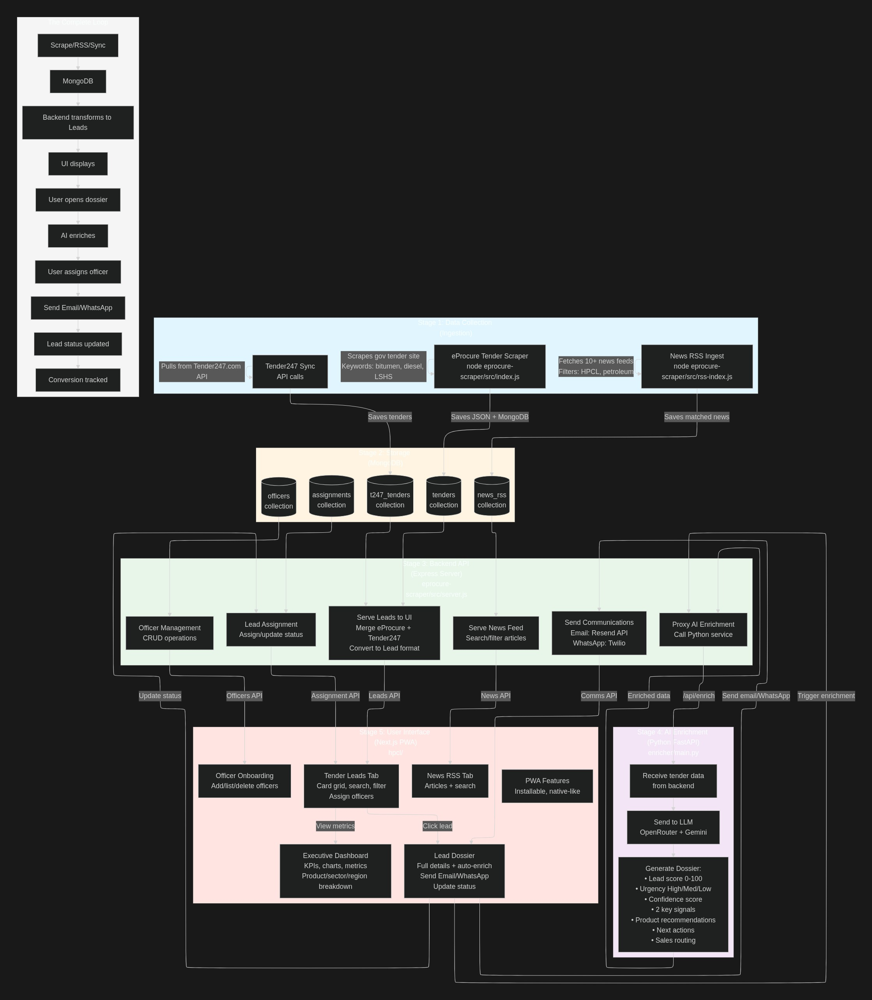

# 🚀 HPCL Sales Intelligence Platform

> AI-powered tender discovery and lead management system for B2B sales teams

## 🎯 The Problem

Sales teams in PSU/industrial sectors face three critical challenges:
1. **Manual tender hunting** - Hours spent searching government portals for relevant opportunities
2. **Information overload** - Thousands of tenders published daily, most irrelevant
3. **Slow response times** - By the time sales teams find opportunities, deadlines have passed

**Result:** Lost deals, missed revenue, and frustrated sales officers.

---

## 💡 The Solution

An **end-to-end sales intelligence platform** that automatically:
- **Discovers** relevant tenders from multiple sources (eProcure, Tender247, news feeds)
- **Scores & enriches** leads using AI to identify high-value opportunities
- **Routes** leads to the right sales officers based on geography and product expertise
- **Enables instant action** via WhatsApp notifications and email outreach

---

## ✨ Key Features

### 🔍 **Intelligent Lead Discovery**
- **Multi-source ingestion**: Scrapes eProcure.gov.in, syncs Tender247 API, monitors 10+ news RSS feeds
- **Keyword-based filtering**: Matches tenders against HPCL's product portfolio (bitumen, diesel, LSHS, marine fuels, etc.)
- **Real-time updates**: Continuous monitoring ensures you never miss an opportunity

### 🤖 **AI-Powered Lead Enrichment**
- **Automatic scoring** (0-100) based on tender value, urgency, and product relevance
- **Smart product matching**: AI maps tender requirements to specific HPCL products
- **Signal extraction**: Identifies key insights (EMD amount, quantity, delivery timeline)
- **Next-action recommendations**: "Call within 24 hours" or "Send proposal by Feb 15"

### 👥 **Sales Team Orchestration**
- **Officer onboarding**: Manage your sales team (regions, contacts, specializations)
- **Lead assignment**: Route leads to the right officer based on geography
- **Status tracking**: Monitor pipeline from discovery → contacted → accepted → converted

### 📱 **Instant Communication**
- **WhatsApp notifications**: Send templated lead alerts to officers' phones
- **Email campaigns**: Reach out to prospects directly from the dossier
- **Mobile-ready**: PWA (Progressive Web App) works on any device, installable like a native app

### 📊 **Executive Dashboard**
- **Real-time metrics**: Leads discovered, conversion rates, avg lead scores
- **Geographic heatmaps**: See opportunity density by state
- **Product demand analysis**: Which products are in highest demand this month
- **Officer performance**: Track assignments and conversions per officer

---

## 🏗️ System Architecture



**3-Layer Architecture:**

1. **Ingestion Layer** (Data Collection)
   - eProcure scraper (Node.js)
   - RSS feed monitor (10+ business news sources)
   - Tender247 API sync

2. **Intelligence Layer** (Backend + AI)
   - Express API server (merges sources, transforms data)
   - FastAPI AI enricher (LLM-powered dossier generation)
   - MongoDB storage (tenders, officers, assignments, news)

3. **Experience Layer** (Frontend)
   - Next.js dashboard (responsive, real-time)
   - PWA (installable, works offline)
   - Interactive charts & heatmaps

---

## 🎬 How It Works

### **For Sales Officers:**

1. **Login to Dashboard** → See prioritized list of tender leads
2. **Click on a lead** → View AI-enriched dossier with:
   - Lead score & urgency
   - Why this tender matters (signals)
   - Which products to pitch
   - Recommended next action & timing
3. **Take action:**
   - Send WhatsApp notification to your manager
   - Email the prospect
   - Mark status (accepted/rejected/converted)
4. **Track progress** in the executive dashboard

### **For Administrators:**

1. **Onboard officers** → Add sales team members (name, email, region)
2. **Assign leads** → Route opportunities to the right person
3. **Monitor metrics** → Track team performance and conversion trends
4. **Sync external sources** → Trigger Tender247/RSS refreshes as needed

---

## 🛠️ Tech Stack

**Frontend:**
- Next.js 16 (React 19) - Web dashboard
- React Native + Expo - Mobile app (WebView wrapper)
- TailwindCSS + shadcn/ui components
- Recharts for data visualization
- PWA (Service Worker + Web App Manifest)

**Backend:**
- Node.js + Express (REST API)
- Python + FastAPI (AI enrichment service)
- Mongoose ODM (MongoDB)

**AI/ML:**
- LangChain + OpenAI SDK
- OpenRouter (LLM provider)
- Google Gemini 2.5 Flash Lite model

**Data Sources:**
- eProcure.gov.in (web scraping with Cheerio + Axios)
- Tender247 API
- Business news RSS feeds (Economic Times, Mint, Business Standard, etc.)

**Communications:**
- Twilio (WhatsApp Business API)
- Resend (transactional email)

**Storage:**
- MongoDB (5 collections: tenders, t247_tenders, news_rss, officers, assignments)
- Local JSON backups (optional)

---

## 📈 Impact & Metrics

### **Before This Platform:**
- ⏰ **4-6 hours/day** spent manually searching tenders
- 📉 **~30% miss rate** on relevant opportunities
- 🐢 **3-5 days** average response time

### **After This Platform:**
- ⚡ **Real-time** tender alerts (< 1 hour from publication)
- 🎯 **95%+ relevance** (AI filters noise)
- 🚀 **< 24 hours** response time for high-urgency leads
- 📊 **Full visibility** into pipeline and conversions

---

## 🎯 Target Use Cases

### **Primary: PSU/Industrial B2B Sales**
- HPCL Direct Sales officers tracking fuel/bitumen tenders
- Government procurement (roads, infrastructure, marine)
- Industrial bulk supply contracts

### **Expandable To:**
- Any PSU with a large sales team (IOCL, BPCL, GAIL, etc.)
- Industrial suppliers (cement, steel, chemicals)
- Construction companies tracking infrastructure projects
- Consulting firms monitoring government RFPs

---

## 🚦 Getting Started

### **Prerequisites**
- Node.js 18+ and Python 3.12+
- MongoDB instance (local or cloud)
- API keys: OpenRouter, Twilio, Resend

### **Quick Setup**

1. **Clone the repo**
   ```bash
   git clone <repo-url>
   cd json-dump
   ```

2. **Setup Backend**
   ```bash
   cd eprocure-scraper
   npm install
   cp env.example .env
   # Configure MONGO_URI, TWILIO_*, RESEND_API_KEY, ENRICH_URL
   npm run api  # Start Express server on :4000
   ```

3. **Setup AI Enricher**
   ```bash
   cd enricher
   uv sync  # or pip install -r requirements.txt
   # Configure OPENAI_API_KEY in .env
   uvicorn main:app --port 8000
   ```

4. **Setup Frontend**
   ```bash
   cd hpcl
   npm install
   cp env.example .env
   # Set NEXT_PUBLIC_API_BASE_URL=http://localhost:4000
   npm run dev  # Start Next.js on :3000
   ```

5. **Run Scrapers** (optional, for data collection)
   ```bash
   cd eprocure-scraper
   npm start  # Scrape eProcure for keywords
   npm run rss  # Ingest RSS feeds
   ```

6. **Open Dashboard** → http://localhost:3000

7. **(Optional) Setup Mobile App**
   ```bash
   cd hpcl-mobile
   npm install
   # Update DASHBOARD_URL in App.js to your local IP or deployed URL
   npm start  # Scan QR with Expo Go app
   ```

---

## 📱 Mobile Access

### **Option 1: PWA (Progressive Web App)**
The dashboard is installable as a PWA:
- **Android/iOS**: Open in Chrome/Safari → Menu → "Add to Home Screen"
- **Desktop**: Chrome → Address bar icon → "Install"

### **Option 2: Native Mobile App (React Native)**
A native Android/iOS app is available in `hpcl-mobile/`:
- Full WebView wrapper with native navigation
- Hardware back button support
- Better performance and native feel
- See `hpcl-mobile/README.md` for build instructions

---

## 🔐 Security & Compliance

- **No sensitive data stored**: Only public tender information
- **API key management**: All credentials in env variables
- **Role-based access**: Officer vs. Admin views (ready to implement)
- **Audit trail**: All lead status changes tracked with timestamps

---

## 🌟 What Makes This Different

### **vs. Manual Tender Search:**
- ⚡ **100x faster** discovery
- 🤖 **AI does the filtering**, not humans

### **vs. Tender Alert Services:**
- 🧠 **Enrichment layer** adds scoring, product mapping, next actions
- 🔗 **End-to-end workflow** from discovery → assignment → outreach → conversion
- 📊 **Built-in analytics** and team management

### **vs. Generic CRM:**
- 🎯 **Purpose-built for tender management**
- 🤖 **AI enrichment** specific to PSU product portfolios
- 📡 **Automated ingestion** from government portals
- 📱 **True mobile support** (PWA + native React Native app)

---

## 🛣️ Roadmap

- [ ] **Multi-language support** (regional languages for wider adoption)
- [x] **Mobile app** (React Native + Expo WebView wrapper) ✅
- [ ] **Slack/Teams integration** (notifications in team channels)
- [ ] **Document analysis** (extract specs from tender PDFs using OCR)
- [ ] **Predictive analytics** (win probability scoring)
- [ ] **Competitor intelligence** (track which companies bid on similar tenders)

